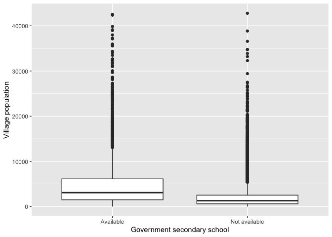
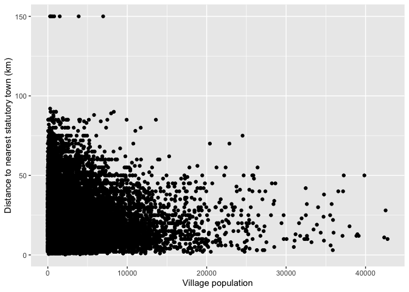

# Data Wrangling Exercise (Bihar Dataset)
Lahari KV

# Intro

**This exercise, based on a census data set containing about 40,000
villages in Bihar, demonstrates basic data wrangling skills such as data
cleaning, creation of new columns, calculating summary statistics, and
producing graphs from the data available.**

## Importing relevant libraries

``` r
library(tidyverse)
library(janitor)
library(infer)
library(readxl)
```

## Loading the dataset

``` r
bihar <- read_excel("/Users/laharikv/Downloads/bihar.xlsx")
head(bihar)
```

    # A tibble: 6 × 396
      `State Code` `State Name` `District Code` `District Name`  `Sub District Code`
             <dbl> <chr>                  <dbl> <chr>            <chr>              
    1           10 BIHAR                    203 Pashchim Champa… 01013              
    2           10 BIHAR                    203 Pashchim Champa… 01013              
    3           10 BIHAR                    203 Pashchim Champa… 01013              
    4           10 BIHAR                    203 Pashchim Champa… 01013              
    5           10 BIHAR                    203 Pashchim Champa… 01013              
    6           10 BIHAR                    203 Pashchim Champa… 01013              
    # ℹ 391 more variables: `Sub District Name` <chr>, `Village Code` <dbl>,
    #   `Village Name` <chr>, `CD Block Code` <chr>, `CD Block Name` <chr>,
    #   `Gram Panchayat Code` <chr>, `Gram Panchayat Name` <chr>,
    #   `Reference Year` <dbl>, `Sub District Head Quarter (Name)` <chr>,
    #   `Sub District Head Quarter (Distance in km)` <dbl>,
    #   `District Head Quarter  (Name)` <chr>,
    #   `District Head Quarter  (Distance in km)` <dbl>, …

## Cleaning the dataset (standardising column names)

``` r
bihar_cleaned <- bihar |> clean_names()
```

# Task 1

**Compute descriptive statistics for village population, and build one
derived variable to look at gender balance.**

``` r
summary <- bihar_cleaned |> summarise(
  mean_population = mean(total_population_of_village, na.rm = TRUE),
  median_population = median(total_population_of_village, na.rm = TRUE),
  sd_population = sd(total_population_of_village, na.rm = TRUE),
  iqr_population = IQR(total_population_of_village, na.rm = TRUE),
  n = sum(!is.na(total_population_of_village))
)

summary
```

    # A tibble: 1 × 5
      mean_population median_population sd_population iqr_population     n
                <dbl>             <dbl>         <dbl>          <dbl> <int>
    1           2058.              1168         2942.           2134 44874

``` r
bihar_1 <- bihar_cleaned |>
  filter(
    !is.na(total_female_population_of_village) &
    !is.na(total_male_population_of_village) &
    total_male_population_of_village > 0
  ) |>
  mutate(
    sex_ratio =
      total_female_population_of_village /
      total_male_population_of_village * 1000
  )

bihar_1 |> filter(!is.na(sex_ratio)) |> summarise(
  mean_sex_ratio = mean(sex_ratio)
)
```

    # A tibble: 1 × 1
      mean_sex_ratio
               <dbl>
    1           931.

**Our typical village has about 2057 people (using the mean as our
measure of “typical”), based on n = 44874 villages with non-missing
data). The population distribution is right skewed. The sex ratio in our
sample averages 930 females per 1,000 males.**

# Task 2

Population and school access

``` r
library(dplyr)
library(ggplot2)

bihar_2 <- bihar_cleaned |>
  mutate(
    school_status = case_when(
      as.character(govt_secondary_school_status_a_1_na_2) %in%
        c("A(1)", "1") ~ "Available",
      as.character(govt_secondary_school_status_a_1_na_2) %in%
        c("NA(2)", "2") ~ "Not available",
      TRUE ~ "Unknown"
    )
  )
# Count villages in each group, including Unknown
bihar_2 |> count(school_status)
```

    # A tibble: 3 × 2
      school_status     n
      <chr>         <int>
    1 Available      4513
    2 Not available 34560
    3 Unknown        5801

``` r
# Median population and number of villages in each known group
bihar_2 |>
  filter(school_status != "Unknown",
         !is.na(total_population_of_village)) |>
  group_by(school_status) |>
  summarise(
    villages = n(),
    median_population = median(total_population_of_village),
    .groups = "drop"
  )
```

    # A tibble: 2 × 3
      school_status villages median_population
      <chr>            <int>             <dbl>
    1 Available         4513              3089
    2 Not available    34560              1305

``` r
# Number excluded because school status is Unknown
bihar_2 |>
  summarise(
    unknown_excluded = sum(school_status == "Unknown")
  )
```

    # A tibble: 1 × 1
      unknown_excluded
                 <int>
    1             5801

``` r
# Side-by-side boxplots
bihar_2 |>
  filter(
    school_status != "Unknown",
    !is.na(total_population_of_village)
  ) |>
  ggplot(aes(x = school_status, y = total_population_of_village)) +
  geom_boxplot() +
  labs(
    x = "Government secondary school",
    y = "Village population"
  )
```



**Villages with a government secondary school have a median population
of 3089 compared with 1085 for villages without one (villages were
Unknown/missing on this variable and excluded).**

**There are multiple outliers in both groups.**

# Task 3

**Check whether bigger villages tend to sit closer to, or farther from,
the nearest town.**

``` r
task3 <- bihar_cleaned |> filter(!is.na(total_population_of_village), !is.na(nearest_statutory_town_distance_in_km)) |> summarise(
  totalrows = n()
) 

task3
```

    # A tibble: 1 × 1
      totalrows
          <int>
    1     39073

``` r
bihar_cleaned |>
  filter(
    !is.na(total_population_of_village),
    !is.na(nearest_statutory_town_distance_in_km)
  ) |>
  ggplot(aes(
    x = total_population_of_village,
    y = nearest_statutory_town_distance_in_km
  )) +
  geom_point() +
  labs(
    x = "Village population",
    y = "Distance to nearest statutory town (km)"
  )
```



**The general trend seems to be: higher the population, lesser the
distance. But outliers exist.**

# Task 4

**Do schools and roads travel together?**

``` r
bihar_4 <- bihar_cleaned |>
  mutate(
    primary_school = case_when(
      as.character(govt_primary_school_status_a_1_na_2) %in% c("1", "A(1)") ~ "Available",
      as.character(govt_primary_school_status_a_1_na_2) %in% c("2", "NA(2)") ~ "Not available",
      TRUE ~ "Unknown"
    ),
    paved_road = case_when(
      as.character(black_topped_pucca_road_status_a_1_na_2) %in% c("1", "A(1)") ~ "Available",
      as.character(black_topped_pucca_road_status_a_1_na_2) %in% c("2", "NA(2)") ~ "Not available",
      TRUE ~ "Unknown"
    )
  )

bihar_4 |>
  count(paved_road, primary_school)
```

    # A tibble: 5 × 3
      paved_road    primary_school     n
      <chr>         <chr>          <int>
    1 Available     Available      22055
    2 Available     Not available   2904
    3 Not available Available      10526
    4 Not available Not available   3588
    5 Unknown       Unknown         5801

``` r
bihar_4 |>
  summarise(
    excluded = sum(paved_road == "Unknown" | primary_school == "Unknown")
  )
```

    # A tibble: 1 × 1
      excluded
         <int>
    1     5801

``` r
bihar_4 |>
  filter(paved_road != "Unknown", primary_school != "Unknown") |>
  count(paved_road, primary_school) |>
  group_by(paved_road) |>
  mutate(row_percent = n / sum(n) * 100) |>
  ungroup()
```

    # A tibble: 4 × 4
      paved_road    primary_school     n row_percent
      <chr>         <chr>          <int>       <dbl>
    1 Available     Available      22055        88.4
    2 Available     Not available   2904        11.6
    3 Not available Available      10526        74.6
    4 Not available Not available   3588        25.4

**Among villages with a black-topped road, 88% also have a government
primary school. Among villages without a paved road, 74% have one. (5804
villages were Unknown on one or both variables and were excluded.)**
